# GPT

## 主要内容和结论：

1. **研究焦点**：探索孤独症患者大脑皮层中特定细胞类型的转录组变化。
2. **关键发现**：研究表明，在孤独症患者中，上层皮层兴奋性神经元和微胶质细胞的突触信号传递受到特别影响。此外，特定基因组在皮层-皮层投射神经元中的失调与孤独症的临床严重程度相关。
3. **细胞类型特异性变化**：研究指出，相比于其他细胞类型，上层皮层神经回路的细胞组分在ASD中呈现更多分子变化。
4. **临床关联**：某些上层投射神经元和微胶质细胞中的基因变化与ASD的临床严重程度有关。

## 使用的方法：

1. **单核RNA测序（snRNA-seq）**：使用这种技术对来自孤独症患者和对照组的前额叶皮层和前扣带皮层组织样本进行分析。
2. **数据分析**：进行了单细胞分群、细胞类型标记表达分析、差异表达基因（DEGs）分析，以及与孤独症遗传风险因素的比较。

## 数据来源：

1. **样本**：共41个样本，包括15个ASD患者和16个对照组成员的前额叶皮层和前扣带皮层组织。
2. **年龄和性别匹配**：样本在年龄、性别、RNA完整性指数和死后时间间隔方面进行了匹配。
3. **附加数据**：还包括8个散发性癫痫患者和7个年龄匹配对照组的额外snRNA-seq数据，以比较ASD和癫痫的变化。

通过这些方法和数据，研究提供了关于孤独症大脑皮层细胞类型特异性分子变化的新见解，并指出特定细胞类型的变化可能与孤独症的临床表现有关。这为未来的治疗提供了潜在的靶点。

## 结论

1. **细胞类型特异性分子变化**：孤独症（ASD）患者的大脑皮层中，特定细胞类型展示出独特的转录组变化。这表明ASD的分子病理学特征具有细胞类型特异性。
2. **上层皮层兴奋性神经元和微胶质细胞的影响**：研究发现，在ASD中，上层皮层兴奋性神经元的突触信号传递和微胶质细胞的分子状态受到显著影响。
3. **与临床严重程度的相关性**：某些细胞类型（特别是皮层-皮层投射神经元）中基因表达的失调与ASD的临床严重程度呈现相关性。
4. **ASD与癫痫的分子变化比较**：通过比较ASD患者和仅患有癫痫的患者的脑组织样本，发现这两种条件在分子层面上存在相似和不同的特征。
5. **特定分子通路的变化**：在ASD中，与突触功能、神经元生长和迁移有关的通路受到影响。这些变化主要在上层投射神经元和微胶质细胞中观察到。
6. **ASD特有的分子变化**：研究指出，ASD样本中观察到的多数分子变化和核心失调途径主要是ASD的原发性病理机制，而非与癫痫相关的次要效应。


# PPT演讲注意的要求

1. 不准拖泥带水
2. 不准讲数字
3. 不准解读图片，直接讲结论，别人问才给她解释
4. 分析方法有什么优缺点


# 文献资料整理

## 研究目的

使用单细胞核测序 探索孤独症患者大脑皮层中不同细胞类型的转录组变化。


## 背景知识

PFC ACC

神经细胞类型


## 材料和方法

1. 54个人，癫痫，孤独症，共患，以及正常人

2. 2个位置，PFC，ACC

   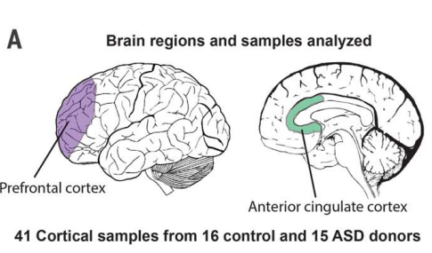

3. 118个测序样本 单细胞核测序，bulk RNA seq，ASD个体的全外显子测序(表明ASD患者基因组上的变异和转录的失调存在潜在联系)

## 分析与结论

1. ASD(52003)和Control(52556)一共产生104559个细胞；由于ASD患者中有一半有癫痫病史，因此使用癫痫(6684)和control(15300)也做了一次单细胞核测序，产生了21984个细胞，用以研究ASD中的转录组变化是不是ASD造成的；  对ASD和Control进行聚类，注释一共分到了17个细胞类型。三大类的各种亚型

   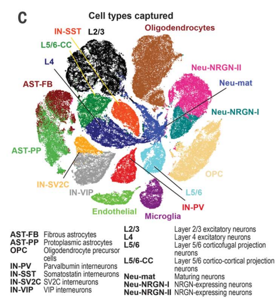

2. 神经细胞的基因的种类和表达量均要比星形胶质细胞高

   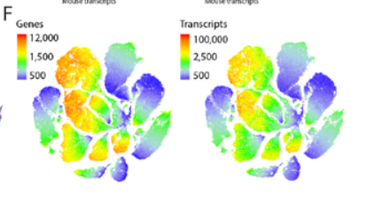

3. 不同位置的细胞类型的比例可能存在显著差异

   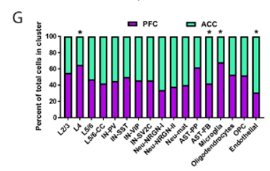

4. ASD患者中AST-PP这一细胞类型的比例显著高于Control

   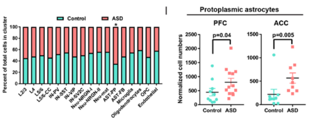

   实验验证：

   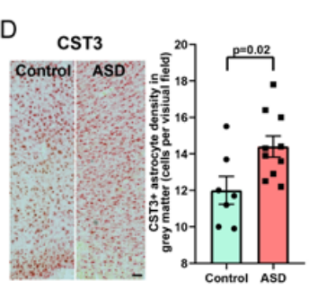

5. 火山图看一下不同细胞类型的差异表达基因  左边是神经细胞的  右边是非神经细胞的

   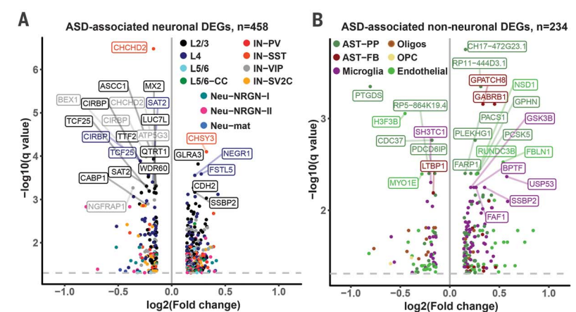

6. 通过自己的bulk RNA seq的差异表达基因和 公共数据集的差异表达基因做相关性分析，超级和检验(重叠是否具有显著性)，证明自己的样本具有代表性； 将自己的样本的单细胞测序和bulk的基因做相关性分析，通过和SFARI中说的和ASD相关的基因做超几何分析，证明自己的发现的结果有代表性；

   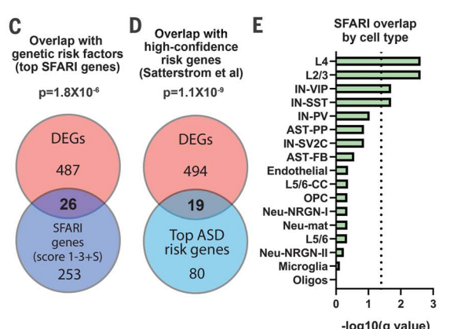

   

   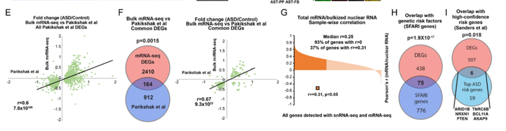

7. GO富集分析显示差异表达基因：1：对所有的差异表达基因做go富集 。2：对和bulk rna显著相关的差异表达基因做go富集 。3： 对神经细胞的差异表达做go富集 。4：对非神经细胞，胶质细胞的DEG做go富集。5： 对存在于多个不同细胞类型(>=2)的DEG做富集

   1和2 1和3 富集到的功能有重合，而1和4的却没有 因此作者指出， ASD的差异表达主要体现在神经细胞的分子功能和生物过程上

   富集5 显示不同细胞类型共有的差异表达基因和以下图【1700372822925】功能相关

   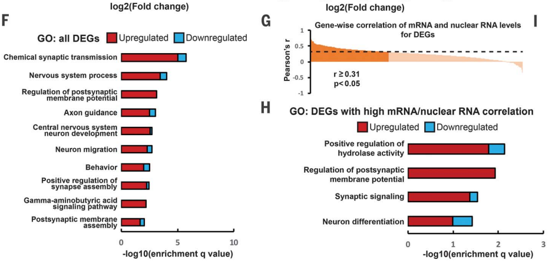

   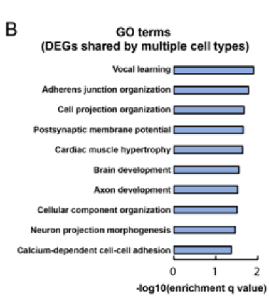

8. 下采样 获得相同数目的不同细胞类型的细胞，比较不同类型细胞的差异表达基因的数目，得出结论ASD患者的分子的失调集中在**上层皮层回路**(PFC)的细胞中   结合前面的1700366993727这张图，就可以解释一下为什么从细胞的差异表达基因的数目知道是哪个大脑位置受影响比较大

   ```
   大脑的上层皮层回路区通常指的是大脑皮层中的前额叶（frontal lobe）区域，特别是前额叶皮层的不同部分。前额叶是大脑的前部，是高级认知和决策功能的主要区域之一，包括运动控制、执行功能、规划、决策制定、社会行为等。前额叶皮层与其他大脑区域通过复杂的神经回路连接在一起，以实现各种认知和行为功能。
   
       前额叶皮层包括多个次区域，其中一些重要的包括：
   
       前额叶背侧（Dorsolateral Prefrontal Cortex，DLPFC）： 位于前额叶的上部，与执行功能、工作记忆、问题解决和认知控制相关。
   
       前额叶眶额区（Orbitofrontal Cortex，OFC）： 位于前额叶的下部，与情感调节、决策制定、奖赏处理和社会行为相关。
   
       前扣带回路（Anterior Cingulate Cortex，ACC）： 位于前额叶的内侧，涉及冲突监控、情感调节和认知控制。
   
       这些前额叶皮层区域之间存在密集的连接，它们与其他大脑区域如运动皮层、感觉皮层以及大脑的下层结构如基底核和丘脑等进行交互，以协调和调节复杂的认知和行为任务。前额叶回路在认知和情感处理、社会互动、运动规划等方面起着关键作用，对人类的高级智能功能至关重要。
       from chatgpt
   ```

   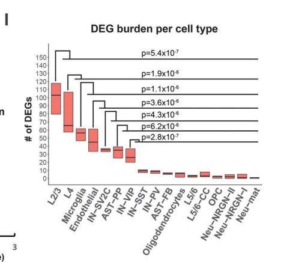

9. 开始研究细胞类型特异性差异表达基因 以L2/3和L4为例，神经元细胞(比如L2/3和L4和VIP)中下调的差异表达基因基因和突触功能以及大脑发育的转录因子相关

   ```
   突触功能包括以下几个关键方面：
   
   神经递质释放： 在突触中，信号传递通常涉及到神经递质的释放。当一个神经脉冲到达突触末梢时，它触发了神经递质的释放。神经递质是化学物质，它通过突触间隙传递到接收神经元的受体上。
   
   受体激活： 接收神经元上的受体会与神经递质结合，从而改变细胞的电位。这种电位变化可以是兴奋性的（使神经元更容易产生动作电位）或抑制性的（抑制动作电位的发生）。
   
   突触可塑性： 突触功能还包括突触可塑性，这是指突触的强度和效率可以随着时间的变化而改变。突触可塑性是学习和记忆的基础，它允许神经网络适应不同的环境和经验。
   
   突触传递信息： 突触功能的主要目的是传递神经信号，将信息从一个神经元传递到另一个神经元或目标细胞（如肌肉细胞）。这是神经系统功能的核心，它允许我们感知环境、做出决策、执行动作等。
   from chatgpt
   ```

   L2/3 下调的是橙色

   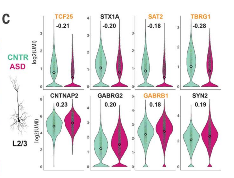

   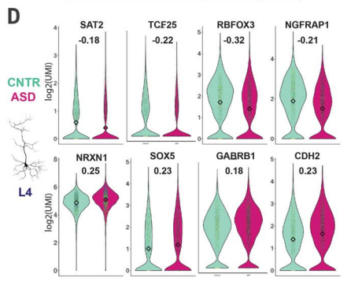

   小胶质细胞(Microglia) 的上调的差异表达基因和小胶质细胞的活化以及调节发育过程的转录因子相关

   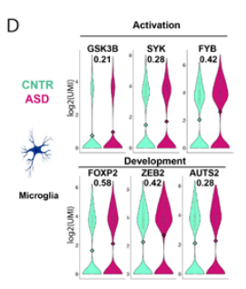

10. Decovolution 分析发现 星形胶质细胞中失调的基因和氨基酸的转运，细胞迁移相关，ASD患者的星形胶质细胞(AST-PP ASD-FB)处于活跃的状态

    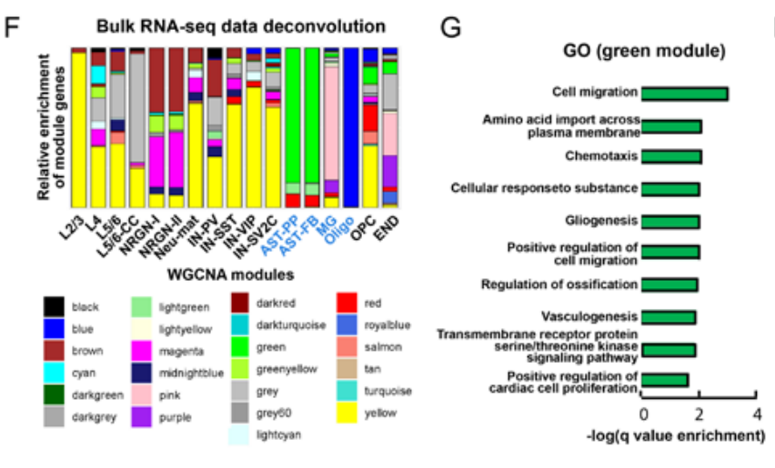

    ```
    decovolution 解卷积怎么做的？
    1. 使用别人较大的ASD相关的bulk RNA-Seq的数据集做WGCNA分析获得共表达基因模块
    2. 计算每一个细胞类型中差异表达基因属于各个共表达基因模块的比例
    3. Co-expression modules often correspond to cell types 
    4. 根据3，使用之前聚类使用的marker基因去和module做Hypergeometric testing，看看overlap是否显著
    5. green : astrocytes, both AST-PP and AST-FB 
       pink : microglia （小胶质细胞）
       blue : oligodendrocytes（少突胶质细胞）
    6. 该方法区分非神经细胞效果还不错，但是区分神经细胞亚型效果不好。在L2/3这种细胞类型中，黄色的模块几乎就是全部，但是，在其他神经细胞类型中也有很多黄色模块的基因，因此使用Deconvolution这个方法区分不同神经细胞亚型效果不好
    ```

    综上：ASD患者的上皮层位置的神经细胞(L2/3 L4 VIP)的发育和突出信号传导失调，并且星形胶质细胞和小胶质细胞的状态存在异常,ASD患者的AST-PP这种胶质细胞的比例显著高于control

    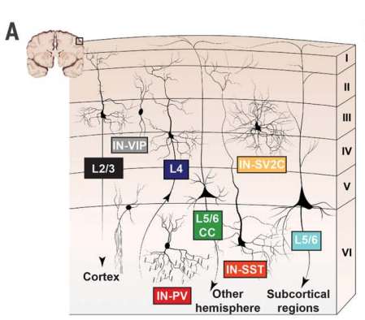

11. 细胞特异性 差异基因表达是否和ASD的严重程度相关？

    ```
    如何做？
    1. 提取每一个细胞类型的差异表达基因	
    2. 使用ASD个体的差异表达基因的FC值和ASD-R score做皮尔森相关性分析，得到每一个DEG和ASD评分的相关系数和p值
    3. fisher检验将一个细胞类型中所有差异表达基因的p值联合起来做显著性检验
    ```

    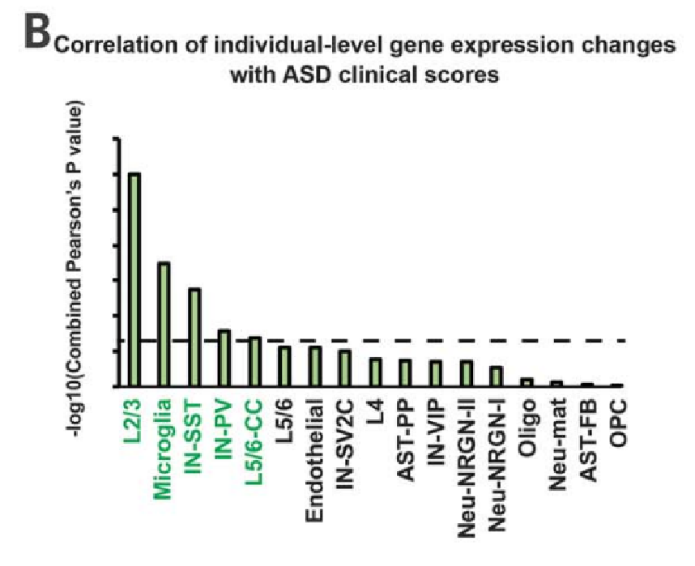

    L2/3神经细胞和小胶质细胞中的DEG的失调和ASD的严重程度最为相关。也就是说在L2/3和小角质细胞中，有更多的差异表达基因和ASD的严重程度具有相关性

    但是 文中指出，和严重程度最为相关的差异表达基因并不是差异表达最为显著的基因，差异表达基因的失调程度不能够准确地和严重程度联系起来。

    

12. ASD个体的全外显子测序，表明ASD患者基因组上的变异和转录的失调存在潜在联系

    

13. 由于ASD患者中有一半有癫痫病史，因此对ASD和癫痫患者的共有的和特有的差异表达基因进行分析，以证明在ASD样本中发现的大多数分子变化和核心失调途径是原发性ASD发病机制的结果，而不是癫痫造成的

    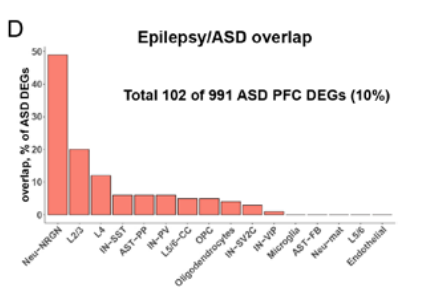

    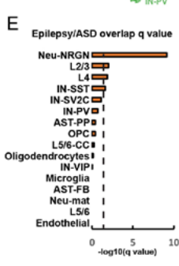

    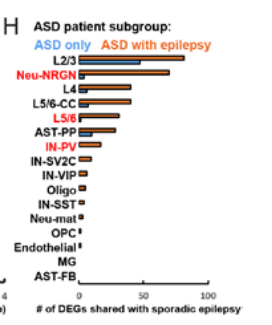


## 总结

这篇文章的主要结论可以归纳如下：

1. **细胞类型特异性分子变化**：孤独症（ASD）患者的大脑皮层中，特定细胞类型展示出独特的转录组变化。这表明ASD的分子病理学特征具有细胞类型特异性。

2. **上层皮层兴奋性神经元和微胶质细胞的影响**：研究发现，在ASD中，上层皮层兴奋性神经元的突触信号传递和小胶质细胞的分子状态受到显著影响。
3. **与临床严重程度的相关性**：某些细胞类型（L2/3,L4,IN-VIP）中基因表达的失调与ASD的临床严重程度呈现相关性。
4. **特定分子通路的变化**：在ASD中，与突触功能、神经元生长和迁移有关的通路受到影响。这些变化主要在上层投射神经元和微胶质细胞中观察到。
5. **ASD与癫痫的分子变化比较**：通过比较ASD患者和仅患有癫痫的患者的脑组织样本，发现这两种条件在分子层面上存在相似和不同的特征。
6. **ASD特有的分子变化**：研究指出，ASD样本中观察到的多数分子变化和核心失调途径主要是ASD的原发性病理机制，而不是癫痫造成的

## 思考：

可以进一步孤独症，癫痫，孤独症和癫痫共患的病人各自特有的和共有的差异表达基因模块，找出他们相似的或者各自特有的特征，进行go或者KEGG注释解释为何共有，为何特有


