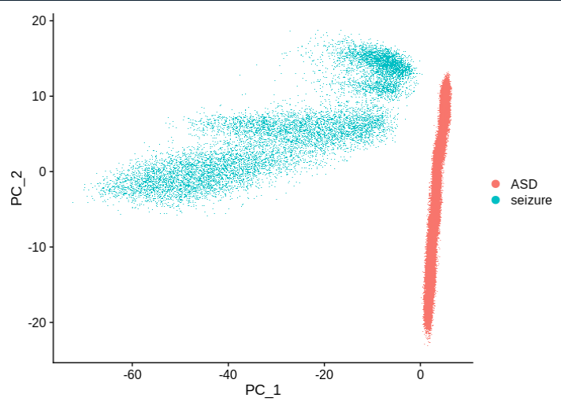
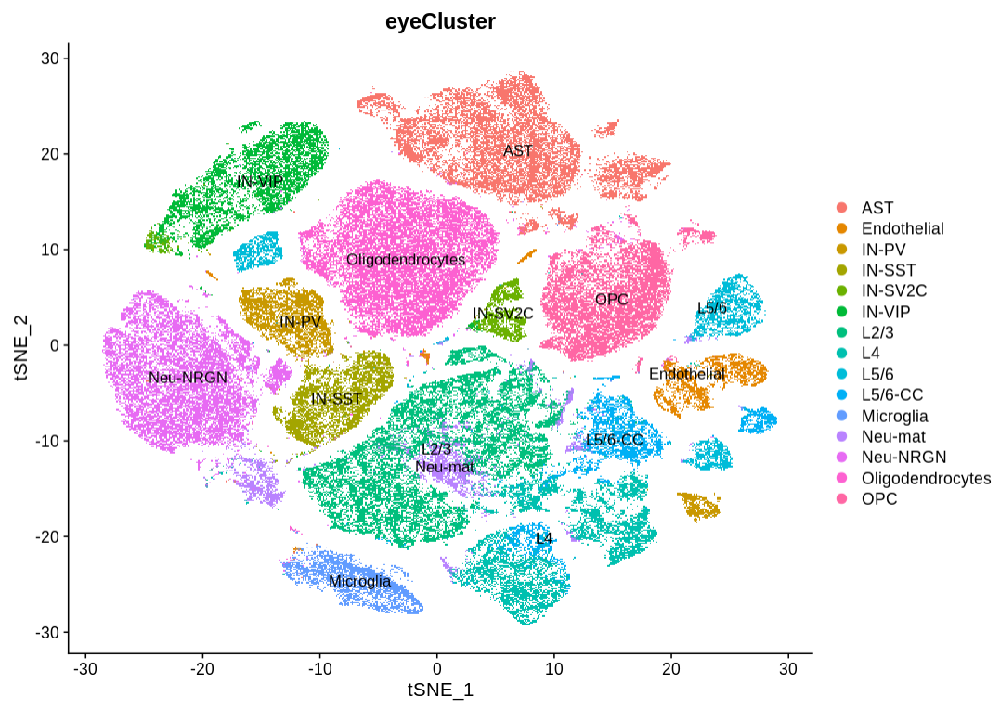

# 2023-11-28

## 导包

```r
# 显著提高seurat5的差异表达分析的速度FindMarkers
library(presto)
# seurat5,单细胞下游
library(Seurat)
# 画图
library(ggplot2)
# 多线程写文件
library(data.table)
library("DOSE")
library("clusterProfiler")
library("org.Hs.eg.db")
```


## 加载ASD和Seizure的数据集

```r
seizure.data = Read10X(data.dir = "seizure/")
ASD.data =  Read10X(data.dir = "ASD/")
seizure = CreateSeuratObject(counts = seizure.data,project = "seizure",min.cells = 3,min.features = 200)
ASD = CreateSeuratObject(counts = ASD.data,project = "ASD",min.cells = 3,min.features = 200)
# 做好内存管理
rm(ASD.data)
rm(seizure.data)
gc()
```


## 统计细胞的基因种类数目(nFeature_RNA)和检测到的基因数目(nCount_RNA)和线粒体基因的比例，并且过滤

### ASD@meta.data 

一共104559个细胞

|              | MAX  | MIN  |
| :-----: | :--: | :--: |
|  **nCount_RNA**  | **114643** | **547** |
| **nFeature_RNA** | **12331** | **499** |
|  **percent.mt**  | **4.999** | **0** |

### seizure@meta.data

一共16880个细胞

|                  |    MAX    |   MIN   |
| :--------------: | :-------: | :-----: |
|  **nCount_RNA**  | **90196** | **220** |
| **nFeature_RNA** | **11143** | **208** |
|  **percent.mt**  | **47.02** |  **0**  |

因为后期要使用文章给的数据做单细胞训练的，ASD是文章给的，我计划保存所有，因此只对seizure的做简单的过滤

```r
seizure <- subset(seizure, subset = nFeature_RNA >=499 & percent.mt < 5)
```

### seizure@meta.data 过滤后的

一共13836个细胞

|              |  MAX  | MIN  |
| :----------: | :---: | :--: |
|  nCount_RNA  | 90196 | 557  |
| nFeature_RNA | 11143 | 499  |
|  percent.mt  | 4.99  |  0   |


## 合并两个数据集

```r
ASD_Seizure = merge(ASD,seizure,project = "ASD_Seizure")
```

### 数据结构

1. 一共104559+13836=118395个细胞

2. 两个数据集，ASD_Seizure@assays[["RNA"]]@layers中有两个layers

   

3. ASD_Seizure@meta.data是合并了的，维度为118395*4

## 

## 遇到的问题

我发现merge以后，先JoinLayers，然后进行normalize和scale然后进行PCA，UMAP，那么这两个批次的点会很明显地分隔开，而先不要JoinLayers，然后进行normalize和scale，相距不会很远。

**猜测和NormalizeData以及ScaleData相关，搞清楚怎么做的**

### 先joinLayers，然后PCA看一下结果


```r
joinFirst = JoinLayers(ASD_Seizure)
joinFirst = NormalizeData(joinFirst)
joinFirst <- FindVariableFeatures(joinFirst, selection.method = "vst", nfeatures = 3000)
joinFirst <- ScaleData(joinFirst, features = VariableFeatures(joinFirst))
joinFirst = RunPCA(joinFirst,npcs = 50,features = rownames(joinFirst))
# 聚成两堆
```



### 然后先不要joinLayers，然后PCA看一下结果


```r
joinLater = ASD_Seizure
joinLater = NormalizeData(joinLater)
joinLater <- FindVariableFeatures(joinLater, selection.method = "vst", nfeatures = 3000)
joinLater <- ScaleData(joinLater, features = VariableFeatures(joinLater))
joinLater = RunPCA(joinLater,npcs = 50,features = rownames(joinLater))
DimPlot(joinLater, reduction = "pca")
# 相对比较均匀
```


## 开始算UMAP和tsne坐标

```r
# 测试了joinLater，就直接赋值即可
# ASD_Seizure = joinLater
# 没有测试joinLater的话
ASD_Seizure = NormalizeData(ASD_Seizure)
ASD_Seizure <- FindVariableFeatures(ASD_Seizure, selection.method = "vst", nfeatures = 3000)
ASD_Seizure <- ScaleData(ASD_Seizure, features = VariableFeatures(ASD_Seizure))
ASD_Seizure = RunPCA(ASD_Seizure,npcs = 50,features = rownames(joinLater))
ElbowPlot(ASD_Seizure,ndims = 50)
# 肘点图选择30
```


### 不做批次处理

```r
# 直接使用PCA的前30个维度确定SNN网络，不做批次处理
ASD_Seizure <- FindNeighbors(ASD_Seizure, reduction = "pca", dims = 1:30,k.param=100)
# 一般来说，k.param越大，能够获得的聚类越少，但是计算时间也会更长。文章中直接对所有细胞开根号，k.param为300多，时间略长，我只选100.
# syh说没什么关系，默认20即可
test <- FindClusters(ASD_Seizure, resolution = 1, cluster.name = "pca_clusters")
# resolution越低，得到的cluster越少
test = RunUMAP(test, reduction = "pca", dims = 1:30, reduction.name = "umap")
# 一共得到34个cluster
DimPlot(test,reduction = "pca",group.by = "orig.ident",label.size = 2,combine = T)

# 第一张图是不做批次处理umap降维后的
DimPlot(test,reduction = "umap",group.by = "pca_cluster",label.size = 2,combine = T)
# 第二张图是按照cluster进行分颜色的
DimPlot(test,reduction = "umap",group.by = "orig.ident",label.size = 2,combine = T)
# 可以说是批次很明显，要去除批次
```


### 做批次处理

**做批次处理发现一个要注意的地方：他会需要很多内存，比如一个118395*50的pca在做cca批次处理的时候，最大使用内存增加31G(MAX:9+31g)，如果发现某个报错，或者一直不动，考虑内存问题，靴靴；**

由此可以看出，**内存管理**真的很重要

```r
# 对pca进行批次处理，产生新的reduction数据
noBathEffect <- IntegrateLayers(object = ASD_Seizure, method = CCAIntegration,orig.reduction = "pca", new.reduction = "integrated.cca",verbose = FALSE)

# 使用批次处理后的 integrated.cca 找邻接矩阵
noBathEffect <- FindNeighbors(noBathEffect, reduction = "integrated.cca", dims = 1:30,k.param=100)
noBathEffect <- FindClusters(noBathEffect, resolution = 1, cluster.name = "cca_clusters")
noBathEffect <- RunUMAP(noBathEffect, reduction = "integrated.cca", dims = 1:30, reduction.name = "umap.cca")
# integrated.cca 在reductions这个列表中
# umap.cca是聚类后的类群的编号，在noBatchEffect@meta.data中

# 一共得到34个cluster

# 第一张图做批次处理umap.cca降维后的
DimPlot(noBathEffect,reduction = "umap.cca",group.by = "cca_cluster",label.size = 2,label = T)
# 第二张图是按照cluster进行分颜色的
DimPlot(noBathEffect,reduction = "umap.cca",group.by = "orig.ident",label.size = 2,label = T)

# 从图中可以看出混合起来了，很不错
```

IntegrateLayers 之后会产生一个和pca维度一样的降维后的integrated.cca


#### umap.cca的图


#### tsne.cca的图


## 

## 添加meta信息到noBathEffect@meta.data

```r
# 1. 整理好所有样本的meta信息
# 2. 通过dplyr的left_join函数添加到Seurat对象的meta.data中

meta.bak = noBathEffect@meta.data
# meta.bak备份一下，免得后面出问题恢复不了
celltype = read.csv("celltype.csv",row.names=1)
celltype[,'X'] = row.names(celltype)
noBathEffect@meta.data[,'X']=row.names(noBathEffect@meta.data)
# dplyr的left_join不支持直接输入列名，因此根据每一个表格的行名创建一个‘X’列，用于左连
noBathEffect@meta.data = left_join(noBathEffect@meta.data,celltype,by="X")
# 用merge函数也可以，但是比较慢，我不喜欢等
rownames(noBathEffect@meta.data) = noBathEffect@meta.data[,"X"]
# 重新将行名赋值回去，不然会出错
## 务必要保证join后的meta的行的顺序和原来的meta.data、SNN、KNN的行名和列名都要一样，不然会报错。
#########记住 记住########
```

### 添加别人注释的细胞类型，然后用于分自己的Seizure的细胞

```r
# 感觉效果还勉强ok
# 下一步就是把meta.csv生成出来，然后将cluster的NA值进行填补
write.csv(noBathEffect@meta.data,"ASD_Seizure_meta.csv")
```


```r
# 比较一下两张图，用眼睛区分下，每一个cluster都代表什么
0 : Oligodendrocytes
1 : Neu-NRGN
2 : OPC
3 : L2/3
4 : AST
5 : L2/3
6 : IN-SST
7 : IN-VIP
8 : L4
9 : IN-PV
10 : Microglia
11 : L4
12 : L5/6-CC
13 : Neu-mat
14 : IN-VIP
15 : AST
16 : L5/6
17 : IN-SV2C
18 : AST
19 : Endothelial
20 : Endothelial
21 : L5/6
22 : L4
23 : L5/6
24 : 无法区分
25 : Neu-NRGN
26 : IN-PV
27 : L5/6-CC
28 : AST
29 : L2/3
30 : OPC
31 : 很小且分不清
32 : L2/3
33 : Oligodendrocytes 很小
```

保存在 [eye.csv](.\pyFixMeta\1_FixCellType\eye.csv)中，然后使用python脚本[fixCellType.py](.\pyFixMeta\1_FixCellType\fixCellType.py)给seizure的那一批细胞注释细胞类型

```python
# 编写python脚本，将cluster对应的细胞类型加入到meta data中
# fixCellType.py
import pandas as pd

meta = pd.read_csv("ASD_Seizure_meta.csv")
meta["eyeCluster"] = meta["cluster"]
celltype = pd.read_csv("eye.csv")
celltype = list(celltype["celltype"])

clusters = set(meta["seurat_clusters"])

for i in range(len(celltype)):
    condition = (meta["cluster"].isna())&(meta["seurat_clusters"]==i)
    meta.loc[condition,"eyeCluster"]=celltype[i]
meta.to_csv("ASD_Seizure_meta_fixCellType.csv")
```

**生成 ASD_Seizure_meta_fixCellType.csv 后，还需要对这个csv文件进行简单处理，删除第一列，将AST_PP和ASD_FB合并为ASD,将Neu-NRGN-II 和 Neu-NRGN-I 合并为Neu-NRGN ，因为是在难以区分开了**

### 给每一个细胞添加样本信息，包括ASD,Seizure，共患等

[所有的样本的信息](.\pyFixMeta\2_FixSampleInfo\sampleInfo.csv)

用于给python脚本[fixSampleInfo.py](.\pyFixMeta\2_FixSampleInfo\fixSampleInfo.py)

```python
import pandas as pd
import numpy as np
meta = pd.read_csv("ASD_Seizure_meta_fixCellType.csv")
sampleInfo = pd.read_csv("sampleInfo.csv")

sampleID = list(sampleInfo["Sample name"])
sampleInfoCol = list(sampleInfo.columns)


for i in sampleID:
    info = np.array(sampleInfo.loc[sampleInfo["Sample name"]==i,])[0]
    condition = meta["cellID"].str.contains(i)
    for j in range(len(sampleInfoCol)):
        meta.loc[condition,sampleInfoCol[j]]=info[j]
meta.to_csv("ASD_Seizure_meta_fixSampleInfo.csv")

```

获得ASD_Seizure_meta_fixSampleInfo.csv后，再稍微处理下，比如修改eplicy为seizure统一名称，进行这些简单的操作以后，就可以将这个作为meta data导入其中用于分析了。**用于进行差异表达分组的[meta data](meta/ASD_Seizure_meta_fix_fixGroup.csv)**

**eyeCluster的结果**

```r
load("noBatchEffect_only.RData")
meta.bak = noBathEffect@meta.data
noBathEffect@meta.data = read.csv("ASD_Seizure_meta_fix.csv",row.names = 1)

```



## 开始差异表达分析

分别对每一个细胞类型做差异表达分析

```r
# 先合并每一个Layer
noBathEffect=JoinLayers(noBathEffect)
save.image("noBathEffect_joinLayer.RData")

load("noBathEffect_joinLayer.RData")
# 务必加载Seurat，会快很多
library(Seurat)
#通过下面这一行就会将noBath@meta.data中的诊断信息给到active.ident
Idents(noBathEffect) = "Diagnosis"

# 找一下ASD和control的差异表达基因
ASD_Control.markers <- FindMarkers(noBathEffect, ident.1 = "ASD",ident.2="Control")
# 找一下ASD分别和Epilepsy和Control的差异表达基因，并且只要正表达的
ASD_ControlEpilepsy.markers <- FindMarkers(noBathEffect, ident.1 = "ASD",ident.2=c("Epilepsy","Control"),only.pos=T)

# 找ASD细胞的和其他所有的差异表达基因
ASD.markers <- FindMarkers(noBathEffect, ident.1 = "ASD")


```

### 只患ASD和Control的差异表达

```r
ASD_Control <- subset(noBathEffect, subset = (Diagnosis=="Control")|(ASD=="yes" & Seizure=="no"))
# 一共85374个细胞
Idents(ASD_Control) = "Diagnosis"
ASD_Control.markers <- FindMarkers(noBathEffect, ident.1 = "ASD",ident.2="Control")

# 合成bulk去做差异表达
```

```r
# 火山图画法
log2FC = 1
padj = 0.05
ASD_Control.markers$threshold="ns";
ASD_Control.markers[which(ASD_Control.markers$avg_log2FC  > log2FC & ASD_Control.markers$p_val_adj <padj),]$threshold="up";
ASD_Control.markers[which(ASD_Control.markers$avg_log2FC  < (-log2FC) & ASD_Control.markers$p_val_adj < padj),]$threshold="down";
ASD_Control.markers$threshold=factor(ASD_Control.markers$threshold, levels=c('down','ns','up'))


ggplot(data=ASD_Control.markers, aes(x=avg_log2FC, y=-log10(p_val_adj), color=threshold)) +
  geom_point(alpha=0.8, size=0.8) +
  geom_vline(xintercept = c(-log2FC, log2FC), linetype=2, color="grey")+
  geom_hline(yintercept = -log10(padj), linetype=2, color="grey")+
  #labs(title= ifelse(""==title, "", paste("DEG:", title)))+
  xlab(bquote(Log[2]*FoldChange))+
  ylab(bquote(-Log[10]*italic(P.adj)) )+
  theme_classic(base_size = 14) +
  scale_color_manual('',labels=c(paste0("down(",table(ASD_Control.markers$threshold)[[1]],')'),'ns',
                                 paste0("up(",table(ASD_Control.markers$threshold)[[3]],')' )),
                     values=c("blue", "grey","red" ) )+
  guides(color=guide_legend(override.aes = list(size=3, alpha=1)))


```


### 只患Seizure和Control的差异表达

```r
同上
```


### 共患和Contron的差异表达

```
同上
```


## go注释和KEGG注释

```R
# id转换
geneEntrezID <- bitr(downGenes$GeneName, fromType="SYMBOL", toType="ENTREZID", OrgDb="org.Hs.eg.db")

go <- enrichGO(gene = downGenes$GeneName,
               OrgDb= org.Hs.eg.db,
               ont = "ALL",
               pAdjustMethod = "BH",
               pvalueCutoff = 0.05,
               qvalueCutoff = 0.05,
               keyType = 'SYMBOL')

barplot(go, drop = TRUE, showCategory =10,split="ONTOLOGY") + facet_grid(ONTOLOGY~., scale='free')


ek <- enrichKEGG(gene = geneEntrezID$ENTREZID, #需要分析的基因的EntrezID
                 organism = "hsa",  #人
                 pvalueCutoff =0.05, #设置pvalue界值
                 qvalueCutoff = 0.05) #设置qvalue界值(FDR校正后的p值）


barplot(ek, x = "GeneRatio", color = "p.adjust", #默认参数
        showCategory =10) #只显示前10


```


## 不精致的WGCNA整理，可以不看

### WGCNA找出共表达基因模块(比较简略，看下一个WGCNA的笔记)

找出Seizure和ASD中都比较多的细胞集合

[单细胞转录组WGCNA到底应该怎么做？ - 简书 (jianshu.com)](https://www.jianshu.com/p/d2991fa79a3e)

提取出这一个细胞类型子集，然后做WGCNA分析

单细胞RNA Seq做WGCNA的效果并不好，建议将同一个单细胞的样本的表达量进行合并

```bash
# 提取L23的细胞看一下数目
L23 <- subset(noBathEffect, subset = (eyeCluster=="L2/3"))

# 提取3000个高变异基因
L23 = FindVariableFeatures(L23,nfeatures = 3000)
```


