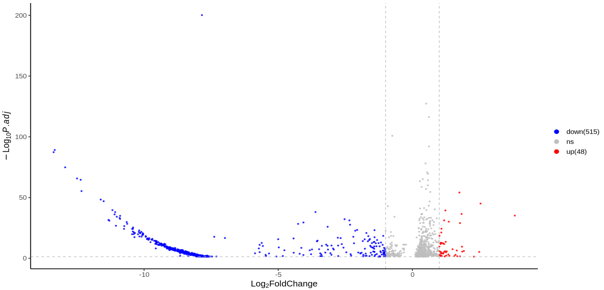
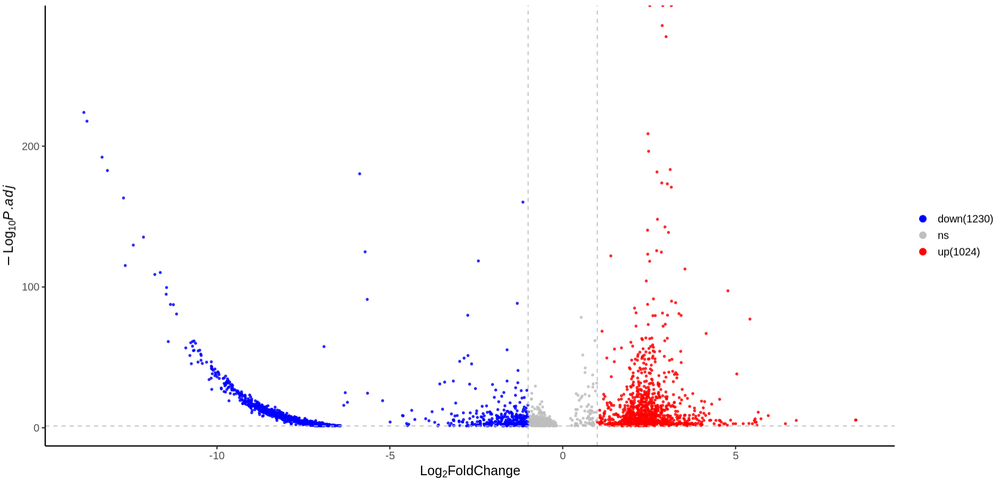
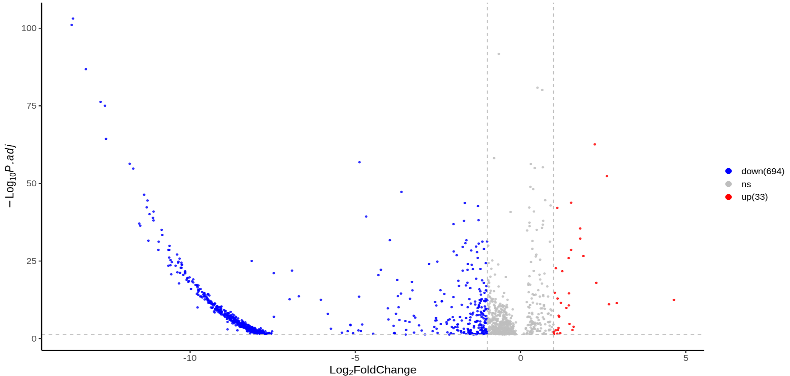
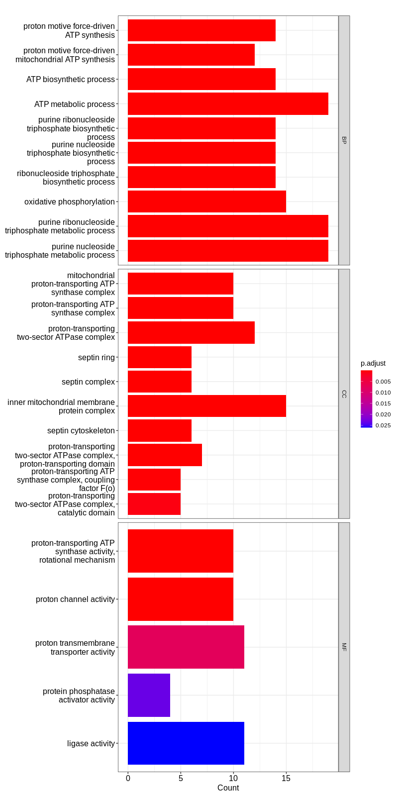
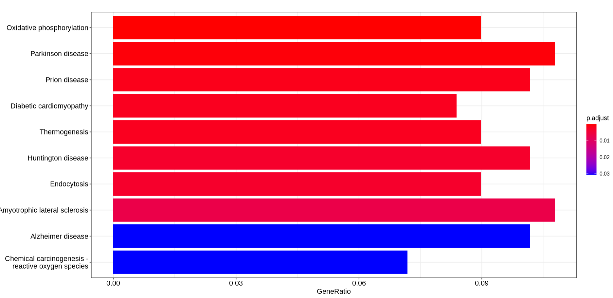
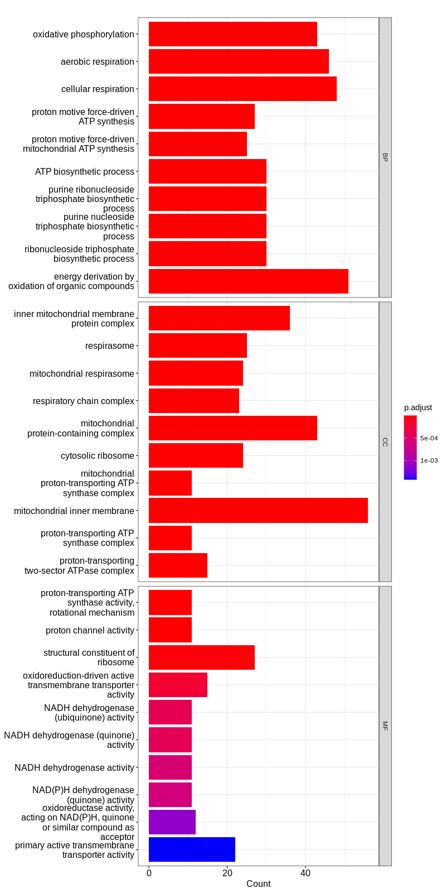
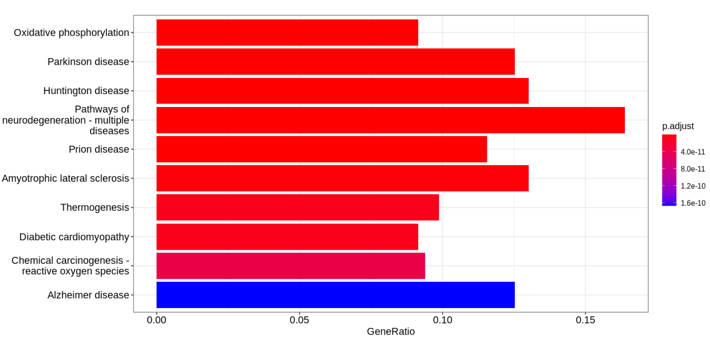
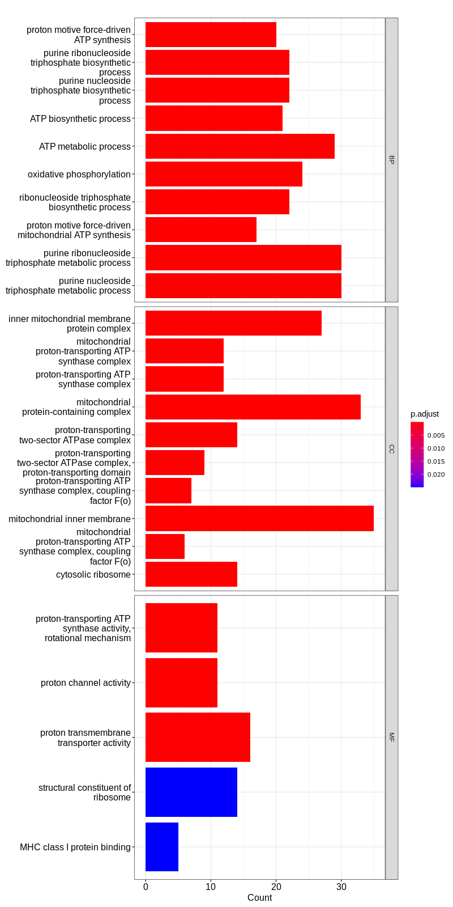
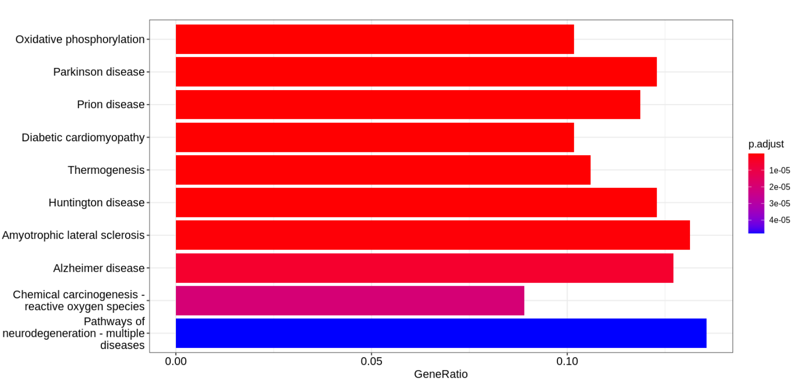
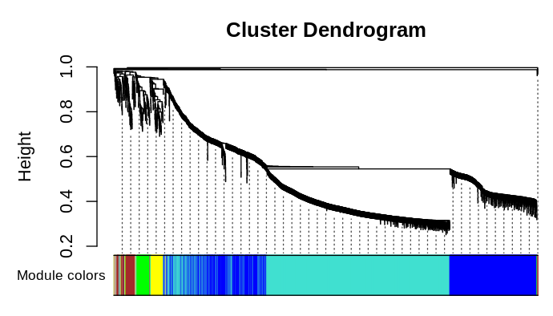

# 导包

```r
library(WGCNA)
library(Seurat)
library(tidyverse)
library(reshape2)
library(stringr)
# 多线程聚类
library(fastcluster)
# 多线程计算距离
library(parallelDist)
library(org.Hs.eg.db)
library(clusterProfiler)

```


# 导入数据，只要PFC位置，AST细胞类型 一共9216个细胞

```r
load("AST_PFC_wgcna.rdata")
```


# 差异表达分析

## ASD和Control的所有差异表达基因

```r
Idents(AST_PFC) = "group"

# 找一下各个分组和Control的差异表达基因
# p_val_adj小于0.05
ASD_Control.markers = FindMarkers(AST_PFC, ident.1 = "ASD",ident.2="Control")
ASD_Control.markers = ASD_Control.markers[ASD_Control.markers$p_val_adj<0.05,]

Seizure_Control.markers =  FindMarkers(AST_PFC, ident.1 = "Seizure",ident.2="Control")
Seizure_Control.markers = Seizure_Control.markers[Seizure_Control.markers$p_val_adj<0.05,]

Comorbidity_Control.markers = FindMarkers(AST_PFC, ident.1 = "Comorbidity",ident.2="Control")
Comorbidity_Control.markers = Comorbidity_Control.markers[Comorbidity_Control.markers$p_val_adj<0.05,]
```

## ASD_Control的火山图

```r
log2FC = 1
padj = 0.05
ASD_Control.markers$threshold="ns";
ASD_Control.markers[which(ASD_Control.markers$avg_log2FC  > log2FC & ASD_Control.markers$p_val_adj <padj),]$threshold="up";
ASD_Control.markers[which(ASD_Control.markers$avg_log2FC  < (-log2FC) & ASD_Control.markers$p_val_adj < padj),]$threshold="down";
ASD_Control.markers$threshold=factor(ASD_Control.markers$threshold, levels=c('down','ns','up'))


ggplot(data=ASD_Control.markers, aes(x=avg_log2FC, y=-log10(p_val_adj), color=threshold)) +
  geom_point(alpha=0.8, size=0.8) +
  geom_vline(xintercept = c(-log2FC, log2FC), linetype=2, color="grey")+
  geom_hline(yintercept = -log10(padj), linetype=2, color="grey")+
  #labs(title= ifelse(""==title, "", paste("DEG:", title)))+
  xlab(bquote(Log[2]*FoldChange))+
  ylab(bquote(-Log[10]*italic(P.adj)) )+
  theme_classic(base_size = 14) +
  scale_color_manual('',labels=c(paste0("down(",table(ASD_Control.markers$threshold)[[1]],')'),'ns',
                                 paste0("up(",table(ASD_Control.markers$threshold)[[3]],')' )),
                     values=c("blue", "grey","red" ) )+
  guides(color=guide_legend(override.aes = list(size=3, alpha=1)))

```



## Seizure和Control的火山图

```r
log2FC = 1
padj = 0.05
Seizure_Control.markers$threshold="ns";
Seizure_Control.markers[which(Seizure_Control.markers$avg_log2FC  > log2FC & Seizure_Control.markers$p_val_adj <padj),]$threshold="up";
Seizure_Control.markers[which(Seizure_Control.markers$avg_log2FC  < (-log2FC) & Seizure_Control.markers$p_val_adj < padj),]$threshold="down";
Seizure_Control.markers$threshold=factor(Seizure_Control.markers$threshold, levels=c('down','ns','up'))


ggplot(data=Seizure_Control.markers, aes(x=avg_log2FC, y=-log10(p_val_adj), color=threshold)) +
  geom_point(alpha=0.8, size=0.8) +
  geom_vline(xintercept = c(-log2FC, log2FC), linetype=2, color="grey")+
  geom_hline(yintercept = -log10(padj), linetype=2, color="grey")+
  #labs(title= ifelse(""==title, "", paste("DEG:", title)))+
  xlab(bquote(Log[2]*FoldChange))+
  ylab(bquote(-Log[10]*italic(P.adj)) )+
  theme_classic(base_size = 14) +
  scale_color_manual('',labels=c(paste0("down(",table(Seizure_Control.markers$threshold)[[1]],')'),'ns',
                                 paste0("up(",table(Seizure_Control.markers$threshold)[[3]],')' )),
                     values=c("blue", "grey","red" ) )+
  guides(color=guide_legend(override.aes = list(size=3, alpha=1)))
```



## Comorbidity和Control的火山图

```r
log2FC = 1
padj = 0.05
Comorbidity_Control.markers$threshold="ns";
Comorbidity_Control.markers[which(Comorbidity_Control.markers$avg_log2FC  > log2FC & Comorbidity_Control.markers$p_val_adj <padj),]$threshold="up";
Comorbidity_Control.markers[which(Comorbidity_Control.markers$avg_log2FC  < (-log2FC) & Comorbidity_Control.markers$p_val_adj < padj),]$threshold="down";
Comorbidity_Control.markers$threshold=factor(Comorbidity_Control.markers$threshold, levels=c('down','ns','up'))


ggplot(data=Comorbidity_Control.markers, aes(x=avg_log2FC, y=-log10(p_val_adj), color=threshold)) +
  geom_point(alpha=0.8, size=0.8) +
  geom_vline(xintercept = c(-log2FC, log2FC), linetype=2, color="grey")+
  geom_hline(yintercept = -log10(padj), linetype=2, color="grey")+
  #labs(title= ifelse(""==title, "", paste("DEG:", title)))+
  xlab(bquote(Log[2]*FoldChange))+
  ylab(bquote(-Log[10]*italic(P.adj)) )+
  theme_classic(base_size = 14) +
  scale_color_manual('',labels=c(paste0("down(",table(Comorbidity_Control.markers$threshold)[[1]],')'),'ns',
                                 paste0("up(",table(Comorbidity_Control.markers$threshold)[[3]],')' )),
                     values=c("blue", "grey","red" ) )+
  guides(color=guide_legend(override.aes = list(size=3, alpha=1)))

```



```r
# 保存火山图的数据
write.csv(ASD_Control.markers,"DEGS_ASD.csv")
write.csv(Seizure_Control.markers,"DEGS_Seizure.csv")
write.csv(Comorbidity_Control.markers,"DEGS_Comorbidity.csv")
```

# 富集分析

```
alldegs = read.csv("AllUpDown.csv")
```

## ASD_Control的up和down

```R
geneEntrezID <- bitr(alldegs$ASD, fromType="SYMBOL", toType="ENTREZID", OrgDb="org.Hs.eg.db")
# go
go_ASD <- enrichGO(gene = geneEntrezID$ENTREZID,OrgDb= org.Hs.eg.db,ont = "ALL", pAdjustMethod = "BH",pvalueCutoff = 0.05,qvalueCutoff = 0.05,keyType = 'ENTREZID')

barplot(go_ASD, drop = TRUE, showCategory =10,split="ONTOLOGY") + facet_grid(ONTOLOGY~., scale='free')
# kegg
ek_ASD <- enrichKEGG(gene = geneEntrezID$ENTREZID, organism = "hsa",pvalueCutoff =0.05,qvalueCutoff = 0.05) 
barplot(ek_ASD, x = "GeneRatio", color = "p.adjust", #默认参数
        showCategory =10) #只显示前10
```





## Seizure_Control的up和down

```
geneEntrezID <- bitr(alldegs$Seizure, fromType="SYMBOL", toType="ENTREZID", OrgDb="org.Hs.eg.db")
# go
go_Seizure <- enrichGO(gene = geneEntrezID$ENTREZID,OrgDb= org.Hs.eg.db,ont = "ALL", pAdjustMethod = "BH",pvalueCutoff = 0.05,qvalueCutoff = 0.05,keyType = 'ENTREZID')
barplot(go_Seizure, drop = TRUE, showCategory =10,split="ONTOLOGY") + facet_grid(ONTOLOGY~., scale='free')
# kegg
ek_Seizure <- enrichKEGG(gene = geneEntrezID$ENTREZID, organism = "hsa",pvalueCutoff =0.05,qvalueCutoff = 0.05) 
barplot(ek_Seizure, x = "GeneRatio", color = "p.adjust", #默认参数
        showCategory =10) #只显示前10
```





## Comorbidity_Control的up和down

```r
geneEntrezID <- bitr(alldegs$Comorbidity, fromType="SYMBOL", toType="ENTREZID", OrgDb="org.Hs.eg.db")
# go
go_Comorbidity <- enrichGO(gene = geneEntrezID$ENTREZID,OrgDb= org.Hs.eg.db,ont = "ALL", pAdjustMethod = "BH",pvalueCutoff = 0.05,qvalueCutoff = 0.05,keyType = 'ENTREZID')
barplot(go_Comorbidity, drop = TRUE, showCategory =10,split="ONTOLOGY") + facet_grid(ONTOLOGY~., scale='free')
# kegg
ek_Comorbidity <- enrichKEGG(gene = geneEntrezID$ENTREZID, organism = "hsa",pvalueCutoff =0.05,qvalueCutoff = 0.05) 
barplot(ek_Comorbidity, x = "GeneRatio", color = "p.adjust", #默认参数
        showCategory =10) #只显示前10
```





```r
save.image("DEGAna.rdata")
# 保存注释结果为csv
write.csv(go_ASD@result,"go_ASD.csv")
write.csv(go_Seizure@result,"go_Seizure.csv")
write.csv(go_Comorbidity@result,"go_Comorbidity.csv")
write.csv(ek_ASD@result,"ek_ASD.csv")
write.csv(ek_Seizure@result,"ek_Seizure.csv")
write.csv(ek_Comorbidity@result,"ek_Comorbidity.csv")
```

# WGCNA分析

## 网络构建和共表达模块识别

```r
# 使用所有的差异表达基因基因WGCNA分析，bulk的
# 先取出孤独症、癫痫和共患的差异表达基因的并集
library(WGCNA)
library(Seurat)
library(tidyverse)
library(reshape2)
library(stringr)
# 多线程聚类
library(fastcluster)
# 多线程计算距离
library(parallelDist)
library(org.Hs.eg.db)
library(clusterProfiler)
load("../AST_PFC_wgcna.rdata")

# 将单细胞的rna 测序数据，来自相同样本的count整合到一个样本中
# 在这个例子中，通过Individual 也就是不同个体进行整合
# 因为前面我们已经将所有来自前额叶皮层的星形胶质细胞给提取出来了，所以直接使用Individual进行整合是可取的
df = AggregateExpression(object = AST_PFC, group.by = "Individual")
df=as.data.frame(df)
# 计算log(cpm+1)矩阵 用它作为基因表达矩阵的定量
cpm <- apply(df ,2, function(x) { x/sum(x)*1000000 })
df = log(cpm+1)
df = as.data.frame(df)
allDEGs = read.csv("../AllUpDown.csv")
uniqueDegs = read.csv("../uniqueDegs.csv",header = 1)
# 所有的差异表达基因的并集
x = df[uniqueDegs$degs,]
x = t(x)
# ASD的
# x = df[allDEGs$ASD,]
# x = na.omit(x)
# x = t(x)
powers = c(1:50)
sft = pickSoftThreshold(x, powerVector = powers, verbose = 3)
cex1 = 0.9;
plot(sft$fitIndices[,1], -sign(sft$fitIndices[,3])*sft$fitIndices[,2],
     xlab="Soft Threshold (power)",ylab="Scale Free Topology Model Fit,signed R^2",type="n",
     main = paste("Scale independence"));
text(sft$fitIndices[,1], -sign(sft$fitIndices[,3])*sft$fitIndices[,2],
     labels=powers,cex=cex1,col="red");
abline(h=0.90,col="red")

plot(sft$fitIndices[,1], sft$fitIndices[,5],
     xlab="Soft Threshold (power)",ylab="Mean Connectivity", type="n",
     main = paste("Mean connectivity"))
text(sft$fitIndices[,1], sft$fitIndices[,5], labels=powers, cex=cex1,col="red")

# 这一行得加，不然可能WGCNA在构建网络的时候无法用到自己的cor函数，就会出错
cor=WGCNA::cor

net = blockwiseModules(x, power = 30,
                       TOMType = "unsigned", minModuleSize = 10,
                       reassignThreshold = 0, mergeCutHeight = 0.25,
                       numericLabels = TRUE, pamRespectsDendro = FALSE,
                       saveTOMs = F,
                       verbose = 5)
moduleColors = labels2colors(net$colors)
table(moduleColors)

# 画出树状图
plotDendroAndColors(net$dendrograms[[1]],moduleColors[net$blockGenes[[1]]],"Module colors",dendroLabels =F ,hang =0.03,addGuide=T,guideHang=0.05)

# names和colnames里面都是矩阵x的列名，都是他们不是同一个对象，需要手动制定好，不然后面会报错
names(x)=colnames(x)
# 计算邻接矩阵
adjacency = adjacency(x, power = 30)
# 计算拓扑重叠矩阵
TOM = TOMsimilarity(adjacency)

# 选出要的模块的TOM矩阵
probes = names(x)
modules = "turquoise"
inModule = moduleColors=="turquoise" | moduleColors=="blue"
modProbes = probes[inModule]
modTOM = TOM[inModule, inModule]

# 导出网络 前500条边
# 通过weight进行排序找到第500条边的权重作为阈值 threshold
cyt = exportNetworkToCytoscape(modTOM,edgeFile = "edge_blue_turquoise.txt", nodeFile = "node_blue_turquoise.txt",weighted = TRUE, threshold = 0.627067069909246,nodeNames = modProbes, nodeAttr = moduleColors[inModule])

# hub基因筛选的链接
## https://www.jianshu.com/p/360dc479c685)

# 找turquoise模块的hub基因
module = "turquoise"
MEList = moduleEigengenes(x, colors = moduleColors)
# KME值接近0,说明这个基因不是该模块的成员：KME接近1或者－1,说明这个基因与该模块密切相关（正相关或者负相关）
MEs = MEList$eigengenes
# 基因和模块的kme
datKME=signedKME(x, MEs, outputColumnName="kME_MM.")
# modNames就是MEs的列名只保留颜色,列名从"kmeblue"变成"blue"
modNames = substring(names(MEs), 3)
column = match(module,modNames)
moduleGenes = moduleColors==module
turquoise_module = as.data.frame(dimnames(data.frame(x))[[2]][moduleGenes])
names(turquoise_module)="genename"

turquoise_KME = as.data.frame(datKME[moduleGenes,column]) 
names(turquoise_KME)="KME"
rownames(turquoise_KME)=turquoise_module$genename
# 自己指定阈值
FilterGenes = abs(turquoise_KME$KME) > 0.99
turquoise_hub = turquoise_module[FilterGenes,"genename"]


# 找blue模块turquoise模块的hub基因
module = "blue"
MEList = moduleEigengenes(x, colors = moduleColors)
# KME值接近0,说明这个基因不是该模块的成员：KME接近1或者－1,说明这个基因与该模块密切相关（正相关或者负相关）
MEs = MEList$eigengenes
# 基因和模块的kme
datKME=signedKME(x, MEs, outputColumnName="kME_MM.")
# modNames就是MEs的列名只保留颜色,列名从"kmeblue"变成"blue"
modNames = substring(names(MEs), 3)
column = match(module,modNames)
moduleGenes = moduleColors==module
blue_module = as.data.frame(dimnames(data.frame(x))[[2]][moduleGenes])
names(blue_module)="genename"

blue_KME = as.data.frame(datKME[moduleGenes,column]) 
names(blue_KME)="KME"
rownames(blue_KME)=blue_module$genename
# 自己指定阈值
FilterGenes = abs(blue_KME$KME) > 0.99
blue_hub = blue_module[FilterGenes,"genename"]


                                                   
                                                   
                                                   
## 这是一种WGCNA的方法，使用单细胞的rna seq做WGCNA,但是效果很差
#AST_PFC = NormalizeData(AST_PFC)
#x = as.data.frame(AST_PFC@assays[["RNA"]]@layers[["data"]])
#row.names(x) = Features(AST_PFC)
#colnames(x) = row.names(AST_PFC@meta.data)
#x = x[uniqueDegs$degs,]
#x = t(x)

```

```R
# 如果报错
Error in (new("standardGeneric", .Data = function (x, y = NULL, use = "everything", :unused arguments (weights.x = NULL, weights.y = NULL, cosine = FALSE)
则 cor = cor <- WGCNA::cor
```


**这个图可能和数据和参数设置不对应，不过没关系，看看即可**




## 关于筛选hub基因  ----KME (module eigengene-based connectivity)

[WGCNA（6）：筛选 hub gene - 简书 (jianshu.com)](https://www.jianshu.com/p/360dc479c685)

代码在前面的代码模块中。

```r
# 找blue模块turquoise模块的hub基因
module = "blue"
MEList = moduleEigengenes(x, colors = moduleColors)
# KME值接近0,说明这个基因不是该模块的成员：KME接近1或者－1,说明这个基因与该模块密切相关（正相关或者负相关）
MEs = MEList$eigengenes
# 基因和模块的kme
datKME=signedKME(x, MEs, outputColumnName="kME_MM.")
# modNames就是MEs的列名只保留颜色,列名从"kmeblue"变成"blue"
modNames = substring(names(MEs), 3)
column = match(module,modNames)
moduleGenes = moduleColors==module
blue_module = as.data.frame(dimnames(data.frame(x))[[2]][moduleGenes])
names(blue_module)="genename"

blue_KME = as.data.frame(datKME[moduleGenes,column]) 
names(blue_KME)="KME"
rownames(blue_KME)=blue_module$genename
# 自己指定阈值
FilterGenes = abs(blue_KME$KME) > 0.99
blue_hub = blue_module[FilterGenes,"genename"]
```


#### 原理：

**KME (eigengene connectivity)为基因和模块相关系数，KME值接近0,说明这个基因不是该模块的成员；KME接近1或者-1,说明这个基因与该模块密切相关(正相关或者负相关)。**


